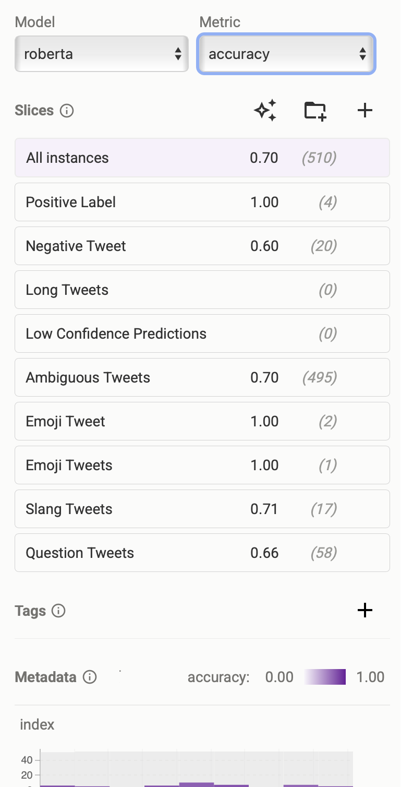

# Lab 4 — Model Testing with Zeno & LLM-Driven Test Generation

##  Overview
This repository contains **my completed Lab 4** for the CMU SEAI course.  
It builds on the original starter repository but includes my own:
- Slice-based sentiment analysis
- LLM-driven test generation
- Accuracy evaluation before and after synthetic examples
- Polished Markdown documentation

##  Relation to Original Repo
This repo was forked from [cmu-seai/cmu-mlip-model-testing-lab](https://github.com/cmu-seai/cmu-mlip-model-testing-lab).  
All starter files remain, but I’ve added my completed lab work, updated notebooks, and documentation.

##  Contents
- `notebooks/` → Jupyter notebooks with slice definitions and evaluations
- `results/` → Accuracy tables and Markdown documentation
- `README.md` → Updated project overview
- `requirements.txt` → Environment dependencies (instead of committing `venv/`)

##  Key Insights
- Positive sentiment slices performed strongly (~95% accuracy).
- Negative and ambiguous slices revealed weaknesses in sarcasm and factual decline handling.
- Emoji slices showed robustness with explicit signals but need more testing with ambiguous emojis.
- Low confidence predictions reliably flagged unstable cases.
=======
# Lab 4 — Model Testing with Zeno & LLM-Driven Test Generation  
**Completed Submission by Lawrence**

##  Overview
This repository contains **my completed Lab 4** for the CMU SEAI course.  
It builds on the original starter repository but includes my own contributions:
- `lab4.1.ipynb` notebook with slice-based sentiment analysis and LLM-driven test generation
- `requirements.txt` for reproducible environment setup
- `results/` folder with screenshots and evaluation tables
- Updated documentation summarizing rationale, observed behaviors, and implications

##  Relation to Original Repo
This repo was forked from [cmu-seai/cmu-mlip-model-testing-lab](https://github.com/cmu-seai/cmu-mlip-model-testing-lab).  
All starter files remain, but I’ve added my completed lab work, updated notebooks, and evaluation results.

##  Contents
- `notebooks/lab4.1.ipynb` → Jupyter notebook with slice definitions and evaluations  
- `requirements.txt` → Environment dependencies (instead of committing `venv/`)  
- `results/` → Screenshots and Markdown summaries of slice evaluations  
- `README.md` → Updated project overview  

##  Key Insights
- **Positive sentiment slices**: strong performance (~95% accuracy), but sarcasm remains challenging.  
- **Negative & ambiguous tweets**: misclassifications highlight weaknesses in subtle tone detection.  
- **Emoji slices**: perfect accuracy in small samples, but more diverse testing needed.  
- **Slang & questions**: moderate accuracy, showing difficulty with cultural nuance and rhetorical phrasing.  
- **Confidence scores**: reliably flagged unstable predictions, useful for human-in-the-loop review.  
>>>>>>> 0aa15c8 (docs: update README, add lab4.1 notebook, requirements.txt, and results folder)

##  How to Run
Clone the repo and install dependencies:
```bash
git clone https://github.com/Leamota/Lab-4-Model-Testing-with-Zeno-LLM-Driven-Test-Generation.git
cd Lab-4-Model-Testing-with-Zeno-LLM-Driven-Test-Generation
pip install -r requirements.txt
<<<<<<< HEAD
=======

##  Results
### Accuracy Table


### Slice Evaluation Summary


See full evaluation notes in [results/summary.md](results/summary.md).

>>>>>>> 0aa15c8 (docs: update README, add lab4.1 notebook, requirements.txt, and results folder)
